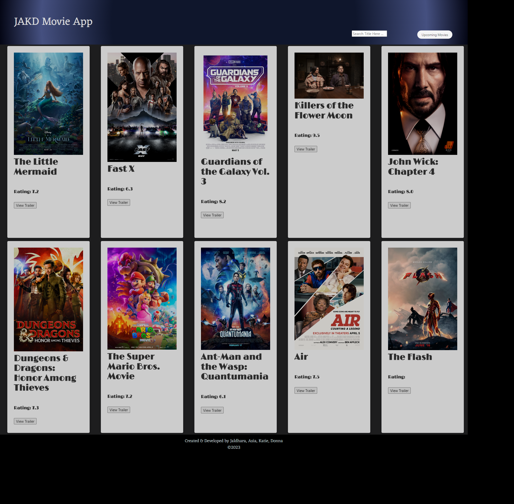

# JAKD Movie App

### Link to deployed application:
[Akemp24.github.io/Movie-app](https://Akemp24.github.io/Movie-app)

 

## Description
This project is a dynamic web app that showcases popular movies. The app fetches movie data from an API and presents the top 10 trending movies in an appealing format. Users can easily navigate through movie options, view details such as ratings and titles, and even watch trailers with a simple click. The user can also search for films by title and view upcoming movies.

 ## User Story
As a movie lover, I want to have a convenient way to explore popular movies and find trailers for them. With the Movie App, I can quickly access a list of top 10 movies and get a glimpse of their ratings and titles. I can also search for specific movies using the search feature and view their trailers directly on the app. This saves me time and effort in finding and watching movie trailers, helping me make better choices about which movies to watch.

## Features
<ol>
<li>Display popular movies: The web page fetches data from an API and displays the top 10 trending movies on the home page.</li>
<li>Movie search: Users can search for a movie by title using the search form.</li>
<li>Watch trailers: Users can click on the "View Trailer" button to watch the trailer of a most-popular movie or searched-by-title movie. The trailer plays in a new window or tab.</li>
<li>Upcoming Movies: Users can click on the "Upcoming Movies" button to fetch the data from an API and display the upcoming movies.</li>
<li>Loading image: While the movie search is fetching, a loading gif is displayed.</li>
<li>Dynamic content: The interface is designed to be user-friendly and dynamically updates the content based on user interactions.</li>
<li>Local storage: The code utilizes local storage to store the top movies and search results for later use.</li>
<li>Return to landing page: The app title is clickable from any page, and will return user to the landing page.</li>
</ol>

## Technologies Used
<ol>
<li>HTML: Used for the structure and layout of the web page.</li>
<li>CSS: Used for styling and presentation of the web page.</li>
<li>Bulma: CSS framework used for specialized styling and presentation of the web page.</li>
<li>JavaScript: Used to fetch movie data from 2 server-side API's, manipulate the DOM, and handle user interactions.</li>
<li>https://imdb-api.com/</li>
<li>https://api.themoviedb.org/</li>
</ol>

## API Key
This project uses 2 different server-side API's to fetch movie data. To use your own API key, replace the placeholder API key in the code with your own. Make sure to update the API endpoint URLs and selected movie id, as needed.

const fetchPopularMoviesURL = `https://imdb-api.com/en/API/MostPopularMovies/${apiKey}`; 
const searchMoviesURL = `https://imdb-api.com/en/API/SearchMovie/${apiKey}`; 
const movieTrailerURL = `https://imdb-api.com/en/API/Trailer/${apiKey}/${movieId}`; 
const upcomingMoviesURL = `https://api.themoviedb.org/3/movie/upcoming?api_key=${apiKey}`; 
